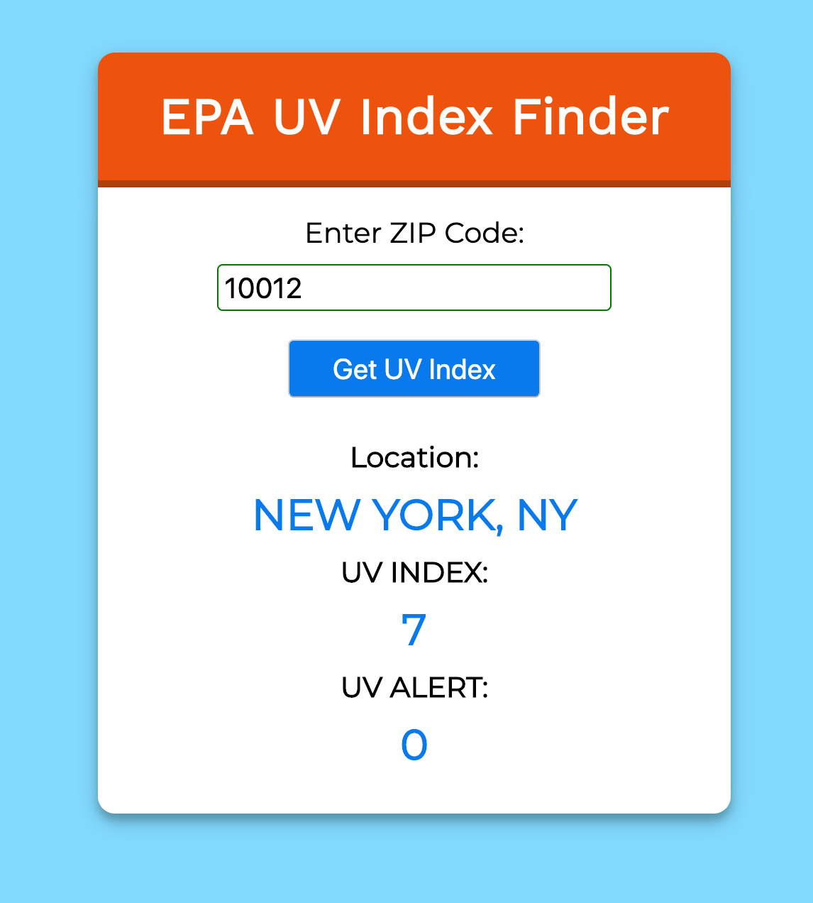

# epa-react-redux

A simple React Redux app that uses the [EPA's Envirofacts API](https://www.epa.gov/enviro/envirofacts-data-service-api) to get a zip code's [UV index](https://www.epa.gov/enviro/web-services#uvrest).

Use the following to launch in the terminal: $ yarn start
